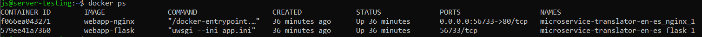
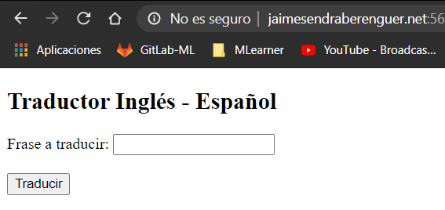

# Microservicio Deep-Learning alojado en DigitalOcean usando Docker, Flask y Nginx


El objetivo de este articulo es desplegar una aplicación de Flask utilizando Docker, con el objetivo de crear un microservicio alojado en un Droplet de DigitalOcean como servidor, con acceso al microservicio bajo un dominio personal con nuestro droplet.

Queremos que uWSGI funcione como servidor web y queremos que el tráfico se enrute a través de Nginx. Estas dos piezas tienen sus propias dependencias, propósito y responsabilidades, por lo que podemos aislar cada una en un contenedor. Por lo tanto, podemos construir dos Dockerfiles para cada servicio, que ```docker-compose``` luego los ejecutara, montará los volúmenes y configurará los hosts para que ambos puedan comunicarse entre sí.

La aplicación a desplegar como microservicio va a ser el _Traductor Inglés-Español_ basado en Transformers que se implementó en el [post anterior](https://medium.com/@jaimesendraberenguer/transformer-para-la-traducci%C3%B3n-de-texto-91c6d57d375d)


## Introducción

**Docker** es una aplicación de código abierto que permite crear, administrar, implementar y replicar aplicaciones usando contenedores. Los contenedores pueden considerarse como un paquete que alberga solo las dependencias requeridas por la aplicación para ejecutarse a nivel de sistema operativo. Esto significa que cada aplicación implementada con Docker tiene un entorno propio y sus requisitos se gestionan por separado.

**Flask** es un micromarco web que se compila con Python. Se denomina micromarco porque no requiere herramientas ni complementos específicos para ejecutarse. El marco de Flask es ligero, flexible y muy estructurado. Esto lo convierte en la opción preferida por encima de otros marcos.

Implementar una aplicación de Flask con Docker le permitirá replicarla en varios servidores con una reconfiguración mínima.

A través de este tutorial, creará una aplicación de Flask y la implementará con Docker.


## Requisitos previos

Para completar este tutorial, necesitará lo siguiente:

- Droplet en DigitalOcean, puede basarse en el siguiente [tutorial.](https://www.digitalocean.com/docs/droplets/how-to/create/)
- Un usuario no root con privilegios sudo configurados siguiendo la [guía Configuración inicial para servidores con Ubuntu 18.04.](https://www.digitalocean.com/community/tutorials/initial-server-setup-with-ubuntu-18-04)
- Un servidor de Ubuntu 18.04 con Docker instalado, configurado siguiendo este [tutorial.](https://www.digitalocean.com/community/tutorials/how-to-install-and-use-docker-on-ubuntu-18-04)
- Docker instalado en su servidor, configurado siguiendo este [tutorial.](https://www.digitalocean.com/community/tutorials/como-instalar-y-usar-docker-en-ubuntu-18-04-1-es)
- Nginx instalado siguiendo el paso uno del tutorial [Cómo instalar Nginx en Ubuntu 18.04.](https://www.digitalocean.com/community/tutorials/how-to-install-nginx-on-ubuntu-18-04)
- Lectura y comprensión sobre el artículo [TRANSFORMER para la Traducción de Texto.](https://medium.com/@jaimesendraberenguer/transformer-para-la-traducci%C3%B3n-de-texto-91c6d57d375d)


## Entorno de desarrollo

Antes de nada, vamos a necesitar preparar el entorno de desarrollo para la implementación de la aplicación. Para ello primero procedemos a clonar el [repositorio de GitHub](https://github.com/jaisenbe58r/microservice-translator-en-es) en su servidor, con todo el código necesario para el desarrollo de esta práctica.

```python
cd you_proyect
git clone https://github.com/jaisenbe58r/microservice-translator-en-es.git
```

## Paso 1: Configurar la aplicación de Flask

El directorio ```microservice-translator-en-es``` contendrá todos los archivos relacionados con la aplicación de Flask, como sus vistas y modelos. Las vistas son el código para responder a las solicitudes a su aplicación. Los modelos crean componentes de aplicaciones, y admiten patrones comunes dentro de una aplicación y entre varias de estas.

El directorio ```static``` es el punto en el que se alojan recursos como los archivos de imagen, CSS y JavaScript. El directorio ```templates``` es el espacio en el que dispondrá las plantillas HTML para su proyecto. El directorio ```model```será donde se guardarán los checkpoints de los modelos entrenados del Transformer.

El archivo ```requirements.txt``` especifica las dependencias que el administrador de paquetes pip instalará en la implementación de Docker:


```txt
Flask==1.0.2
uWSGI==2.0.17.1
tensorflow-cpu==2.3.0
tensorflow_datasets==3.2.1
mlearner==0.2.7
```

El archivo ```app.py``` del directorio app contendrá la mayor parte de la lógica de nuestra aplicación web. No profundizaré en cómo funciona Flask, pero puedes obtener más información en su amplia [documentación.](https://flask.palletsprojects.com/en/1.0.x/quickstart/)

```python
import flask
from flask import Flask, render_template, request

from utils.load_model import ValuePredictor

app = Flask(__name__)

@app.route('/')
@app.route('/index')
def index():
    return flask.render_template('index.html')

@app.route('/result', methods = ['POST'])
def result():
    if request.method == 'POST':
        to_predict_list = request.form.to_dict()
        to_predict_list = list(to_predict_list.values())
        try:
            to_predict_list = list(map(str, to_predict_list))
            result = ValuePredictor(to_predict_list)
            prediction=f'es: {result}'
        except ValueError:
            prediction='Error en el formato de los datos'

        sentence=f'en: {to_predict_list[0]}'
        return render_template("result.html", sentence=sentence, prediction=prediction)

if __name__ == '__main__': 

    app.run(host='0.0.0.0')
```

La línea ```@app.route``` sobre la función se conoce como decorador, estos decoradores modifican la función que los sigue. En este caso, el decorador indica a Flask la URL que desencadenará la función ```index()```. Esta función renderizará el ```index.html``` en el momento que el servidor reciba una petición ```GET``` a ```/``` o ```/index```.


El archivo ```app.ini``` contendrá las [configuraciones de uWSGI](https://uwsgi-docs.readthedocs.io/en/latest/Configuration.html) para nuestra aplicación. uWSGI es una opción de implementación para Nginx que es tanto un protocolo como un servidor de aplicaciones. El servidor de aplicaciones puede proporcionar los protocolos uWSGI, FastCGI y HTTP.

```ini
[uwsgi]
protocol = uwsgi
; This is the name of our Python file
; minus the file extension
module = app
; This is the name of the variable
; in our script that will be called
callable = app
master = true
; Set uWSGI to start up 5 workers
processes = 5
; We use the port 56733 which we will
; then expose on our Dockerfile
socket = 0.0.0.0:56733
vacuum = true
die-on-term = true
```

Este código define el módulo desde el que se proporcionará la aplicación de Flask, en este caso es el archivo ```app.py```. La opción _callable_ indica a uWSGI que use la instancia de app exportada por la aplicación principal. La opción master permite que su aplicación siga ejecutándose, de modo que haya poco tiempo de inactividad incluso cuando se vuelva a cargar toda la aplicación.


## Paso 2: Configurar Docker

Vamos a necesitar dos imágenes de docker, una con Flask y otra con Nginx. El archivo Dockerfile es un documento de texto que contiene los comandos utilizados para ensamblar la imagen. El archivo ```start.sh``` es una secuencia de comandos shell que creará el servicio compuesto por las dos imagenes y un contenedores desde ```Dockerfile```, estos comandos especifican la forma en que se creará la imagen y los requisitos adicionales que se incluirán.

### Construcción de la imagen con Flask

```Dockerfile
# Dockerfile-flask
#  Python 3 image
FROM python:3
RUN apt -qq -y update \
	&& apt -qq -y upgrade
# Set an environment variable with the directory
# where we'll be running the app
ENV APP /app
# Create the directory and instruct Docker to operate
# from there from now on
RUN mkdir $APP
WORKDIR $APP
# Expose the port uWSGI will listen on
EXPOSE 56733
# Copy the requirements file in order to install
# Python dependencies
COPY requirements.txt .
# Install Python dependencies
RUN pip install -r requirements.txt
# We copy the rest of the codebase into the image
COPY . .
# Finally, we run uWSGI with the ini file we
# created earlier
CMD [ "uwsgi", "--ini", "app.ini" ]
```

En este ejemplo, la imagen de Docker se creará a partir de una imagen existente, ```python:3```, correspondiente a una imagen ligera de _python3_.

Antes de de seleccionar el puerto de trabajo, en este caso el ```56733```, primero asegúrese de disponer de un puerto abierto para usarlo en la configuración. Para verificar si hay un puerto libre, ejecute el siguiente comando:

```cmd
sudo nc localhost 56733 < /dev/null; echo $?
```

Si el resultado del comando anterior es ```1```, el puerto estará libre y podrá utilizarse. De lo contrario, deberá seleccionar un puerto diferente y repetir el procedimiento.

Las últimas líneas copia el archivo ```requirements.txt``` al contenedor para que pueda ejecutarse y luego se analiza el archivo ```requirements.txt``` para instalar las dependencias especificadas. También copiaremos todo el directorio de trabajo del repositorio dentro de la imagen para posteriormente compartarlo como volumen externo.


### Construcción imagen de Nginx en Docker

Antes de implementar la construcción de la imagen del contenedor Nginx, crearemos nuesto archivo de configuración que le dirá a Nginx cómo enrutar el tráfico a uWSGI en nuestro otro contenedor. El archivo ```app.conf``` reemplazará el ```/etc/nginx/conf.d/default.conf``` que el contenedor Nginx incluye implícitamente. [Lea más sobre los archivos conf de Nginx aquí.](http://nginx.org/en/docs/beginners_guide.html)

```conf
server {
    listen 80;
    root /usr/share/nginx/html;
    location / { try_files $uri @app; }
    location @app {
        include uwsgi_params;
        uwsgi_pass flask:56733;
    }
}
```

La línea se uwsgi_pass ```flask:56733``` está utilizando flask como host para enrutar el tráfico. Esto se debe a que configuraremos ```docker-compose``` para conectar nuestros contenedores Flask y Nginx a través del ```flask``` como nombre de host.


Nuestro Dockerfile para Nginx simplemente heredará la última imagen de [Nginx del registro de Docker](https://hub.docker.com/_/nginx/), eliminará el archivo de configuración predeterminado y agregará el archivo de configuración que acabamos de crear durante la compilación. Nombraremos el archivo ```Dockerfile-nginx```.

```Dockerfile
# Dockerfile-nginx
FROM nginx:latest
# Nginx will listen on this port
EXPOSE 80
# Remove the default config file that
# /etc/nginx/nginx.conf includes
RUN rm /etc/nginx/conf.d/default.conf
# We copy the requirements file in order to install
# Python dependencies
COPY app.conf /etc/nginx/conf.d
```


### Implementación del orquestador docker-compose.


Toda la configuración de ```docker-compose``` va en un archivo ```YML``` llamado ```docker-compose.yml``` alojado en la raíz del proyecto. No profundizaré mucho en la sintaxis específica del archivo, pero puedes encontrar información sobre todo lo que puedes hacer con él en la referencia de [redacción del archivo](https://docs.docker.com/compose/compose-file/).

```yml
version: '3'
services:
  flask:
    image: webapp-flask
    build:
      context: .
      dockerfile: Dockerfile-flask
    volumes:
      - "./:/app"
  nginx:
    image: webapp-nginx
    build:
      context: .
      dockerfile: Dockerfile-nginx
    ports:
      - 56733:80
    depends_on:
      - flask
```

Las claves debajo ```services:``` definen los nombres de cada uno de nuestros servicios, contenedores Docker. De ahí, flask y nginx sean los nombres de nuestros dos contenedores.

```yml
imagen: webapp-flask
```

Esta línea especifica qué nombre tendrá nuestra imagen después de crearla. ```docker-compose``` construirá la imagen la primera vez que la lancemos y mantendrá un registro del nombre para todos los lanzamientos futuros.

```yml
build:
  context: .
  dockerfile: Dockerfile-flask
```

```context``` le dice al motor de Docker que solo use archivos en el directorio actual para construir la imagen. En segundo lugar ```dockerfile``` le está diciendo al motor que busque el archivo ```Dockerfile-flask``` para construir la imagen de flask.

```yml
  volumes:
  - "./:/app"
```

Aquí simplemente estamos diciendo a ```docker-compose``` que monte nuestra carpeta actual en el directorio ```/app``` en el contenedor cuando se activa. De esta manera, a medida que hacemos cambios en la aplicación, no tendremos que seguir construyendo la imagen a menos que sea un cambio importante, como una dependencia de un módulo de software. En este caso en el ```Dockerfile```de la imagen de flask ya habiamos preparado este directorio de trabajo.

Para el servicio ```nginx```, hay algunas cosas a tener en cuenta:

```yml
ports: 
  - 56733:80
```

Esta pequeña sección le dice a ```docker-compose```que asigne el puerto ```56733``` de su máquina local al puerto ```80``` del contenedor Nginx (puerto que Nginx sirve por defecto).

```yml
depends_on:
  - flask
```

Tal y como se ha implementado en el ```app.conf```, enrutamos el tráfico de Nginx a uWSGI y viceversa enviando datos a través del ```flask```como nombre de host. Lo que hace esta sección es crear un nombre de host virtual ```flask```en nuestro contenedor ```nginx``` y configurar la red para que podamos enrutar los datos entrantes a nuestra aplicación uWSGI que vive en un contenedor diferente. La ```depends_on``` directiva también espera hasta que el contenedor ```flask```esté en un estado funcional antes de lanzar el contenedor ```nginx```, lo que evita tener un escenario en el que Nginx falla si el host ```flask``` no responde.


## Paso 3: Presentar archivos de plantillas

Las [plantillas](https://flask.palletsprojects.com/en/1.0.x/tutorial/templates/) son archivos que muestran contenido estático y dinámico a los usuarios que visitan su aplicación. En este paso, creará una plantilla HTML con el propósito de producir una página de inicio para la aplicación.

El archivo ```index.html``` pertenece al directorio ```app/templates```:

```html
<!doctype html>

<html lang="es">
  <head>
    <meta charset="utf-8">
    <meta http-equiv="x-ua-compatible" content="ie=edge">
    <title>Traductor Inglés - Español</title>
  </head>
  <body>
    <h2>Traductor Inglés - Español</h2>
    <div>
      <form action="/result" method="POST">
        <label for="English">Frase a traducir: </label>
        <input type="text" id="English" name="English">
        <br>
        <br>
        <input type="submit" value="Traducir">
      </form>
    </div>
  </body>
</html>
```

Por otra parte, se ha creado otro template para el resultado de la traducción ```result.html```:

```html
<!doctype html>

<html lang="es">
  <head>
    <meta charset="utf-8">
    <meta http-equiv="x-ua-compatible" content="ie=edge">
    <title>Traductor Inglés - Español</title>
  </head>
   <body>
      <h2>Traductor Inglés - Español</h2>
   <div>
      <form action="/index" method="GET">
         <h4>Frase a traducir del inglés: </h4>
         <label>    {{ sentence }} </label>
         <h4>Frase traducida al español: </h4>
         <label>    {{ prediction }} </label>
         <br>
         <br>
         <input type="submit" value="Volver">
         <br>
      </form>
   </body>
</html>
```

## Paso 4: Desplegar Aplicación


La secuencia de comandos ```start.sh``` es una secuencia de comandos de shell que nos permitirá ejecutar la contrucción del ```docker-compose.yml```, para que los contenedores se ejecuten en modo background.

```bash
#!/bin/bash
docker-compose up -d
```

La primera línea se denomina _shebang_. Especifica que este es un archivo bash y se ejecutará como comandos. El indicador ```-d``` se utiliza para iniciar un contenedor en el modo de demonio, o como proceso en segundo plano.

Para probar la creación de las imagen de Docker y los contenedores a partir de las imagenes resultantes, ejecute:

```shell
sudo bash start.sh
```

Una vez que la secuencia de comandos termine de ejecutarse, utilice el siguiente comando para enumerar todos los contenedores en ejecución:

```shell
sudo docker ps
```

Verá los contenedores en ejecución en ejecución sobre un mismo servicio. Ahora que se está ejecutando, visite la dirección IP pública de su servidor en el puerto especificado de su navegador http://```IP:56733```. o accediendo desde su dominio personal http://```your-domain:56733```.




Ahora ya puede visitar su aplicación en http://```your-domain:56733``` desde un navegador externo al servidor para ver la la aplicación en ejecución.




## Paso 5: Actualizar la aplicación

A veces, deberá realizar en la aplicación cambios que pueden incluir instalar nuevos requisitos, actualizar el contenedor de Docker o aplicar modificaciones vinculadas al HTML y a la lógica. A lo largo de esta sección, configurará touch-reload para realizar estos cambios sin necesidad de reiniciar el contenedor de Docker.

```Autoreloading``` de Python controla el sistema completo de archivos en busca de cambios y actualiza la aplicación cuando detecta uno. No se aconseja el uso de _autoreloading_ en producción porque puede llegar a utilizar muchos recursos de forma muy rápida. En este paso, utilizará touch-reload para realizar la verificación en busca de cambios en un archivo concreto y volver a cargarlo cuando se actualice o sustituya.

Para implementar esto, abra el archivo uwsgi.ini e incorpore la siguiente linea de código:

```python
touch-reload = /app/uwsgi.ini
```

Esto especifica un archivo que se modificará para activar una recarga completa de la aplicación.

A continuación, si hace una modificación en cualquier _template_ y abre la página de inicio de su aplicación en http://```your-domain:56733``` observará que los cambios no se reflejan. Esto se debe a que la condición para volver a cargar es un cambio en el archivo uwsgi.ini. Para volver a cargar la aplicación, use touch a fin de activar la condición:

```shell
sudo touch uwsgi.ini
```


## Conclusiones

A través de este tutorial, se ha implementado una aplicación de Flask como microservicio y se ha utilizado docker compose para administrar múltiples contenedores que necesitan comunicarse entre sí. Con docker compose podemos  especificar configuraciones que de otra manera tendría que incluir en cada comando ```docker run``` para cada contenedor individual, incluidas las vinculaciones de red y volumen. Debido a que toda la configuración se encuentra en un archivo, puede controlar la versión fácilmente y compartirla con sus pares para que su aplicación se ejecute de la manera más similar posible en todas sus estaciones de trabajo.

También se configuró touch-reload para actualizar su aplicación sin necesidad de reiniciar el contenedor.

Con su nueva aplicación en Docker, ahora podrá realizar el escalamiento de forma sencilla. Para obtener más información sobre el uso de Docker, consulte su [documentación oficial.](https://docs.docker.com/)

Sin embargo, esta no es la manera más eficiente de implementar aplicaciones para producción, ya que, existen servicios mucho más confiables para ayudarlo a hacerlo y al mismo tiempo crear los enlaces de red necesarios entre contenedores cuando sea necesario (por ejemplo, AWS ECS, Heroku, Kubernetes, etc.)

¡Espero que te sirva de útilidad yu pueda desplegar sus aplicaciones satisfactoriamente en producción como un servicio web! Sí es así, deja un aplauso y compartelo en redes sociales para poder compartir este conocimiento con toda la comunidad, ¡Muchas gracias por su atención y nos vemos en el próximo artículo!.

